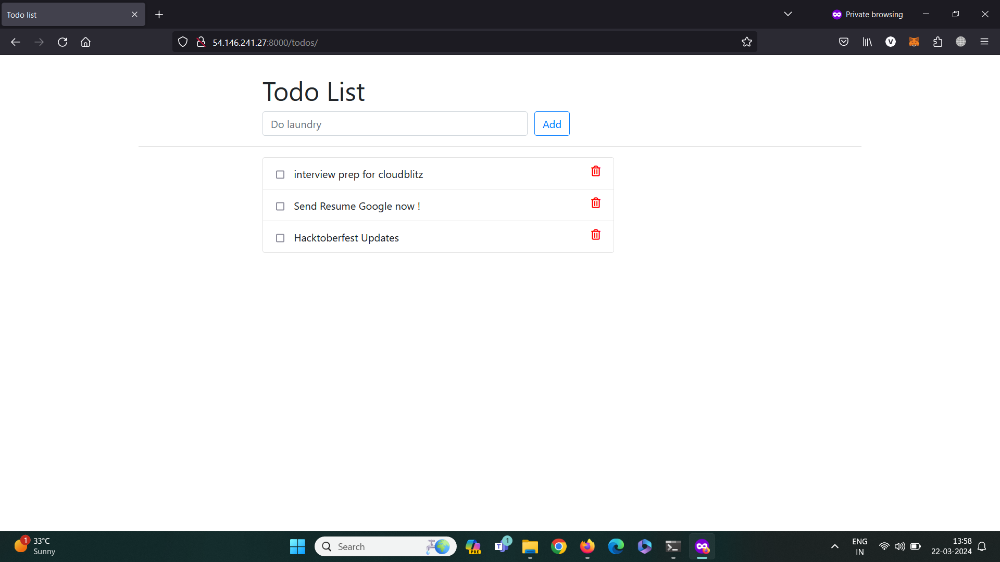

# django-todo-App
A simple todo app built with django.

Reffered git repo : https://github.com/shreys7/django-todo.git



## Getting Started

### Doing this on Local:

Git clone the repo :
```shell
git clone https://github.com/shreys7/django-todo.git
```
Once you have cloned the repo, install python environment into that directory and run the following command:
```shell
apt install python3.10-venv
```
Once it is installed create environment in that directory:
```shell
python3 -mvenv venv # Here venv is the name of your virtual environment
source venv/bin/activate
```
Run the following command to migrate the database. This will create all the migrations file (database migrations) required to run this App.
```shell
python3 manage.py makemigrations
python3 manage.py migrate
```
One last step and then our todo App will be live. We need to create an admin user to run this App. On the terminal, type the following command and provide username, password and email for the admin user
```bash
$ python3 manage.py createsuperuser
```

That was pretty simple, right? Now let's make the App live. We just need to start the server now and then we can start using our simple todo App. Start the server by following command

```shell
python3 manage.py runserver
```
To run this in background use:
```shell
nohup python3 manage.py runserver
```

Once the server is hosted, head over to http://127.0.0.1:8000/todos for the App.

### Doing this by Docker in AWS EC2:

Download [Docker](https://docs.docker.com/engine/install/ubuntu/) for Ubuntu. You can check for other OS also.

Git clone the repository in your AWS instance. 
```shell
git clone https://github.com/Vighnesh-99/django-Todo-with-docker.git
```
Before running the docker build command, change the setting.py ALLOWED_HOST which is present in todoApp dir :
```shell
sudo vim settings.py
# ADD "*" to ALLOWED_HOST = [] in settings.py 
# EX:- ALLOWED_HOST = ["*"] 
```
Go to the directory where Dockerfile is present. Then build the image and run it.
```shell
docker build .
docker run -d -p 8000:8000 docker_img_id
```

Once the docker container is running, head over to http://pub_ip:8000 of your AWS instance for the App.

Cheers and Happy Coding :)
